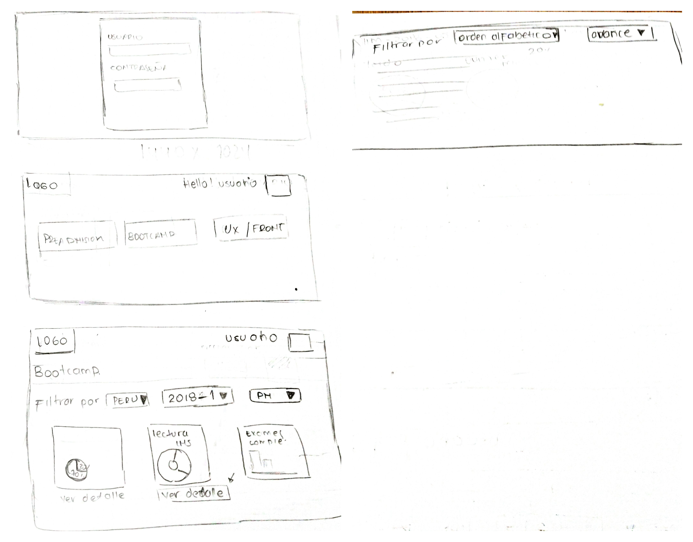
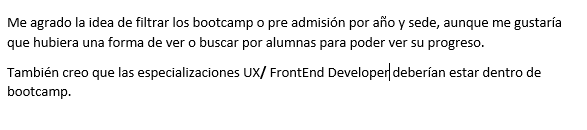
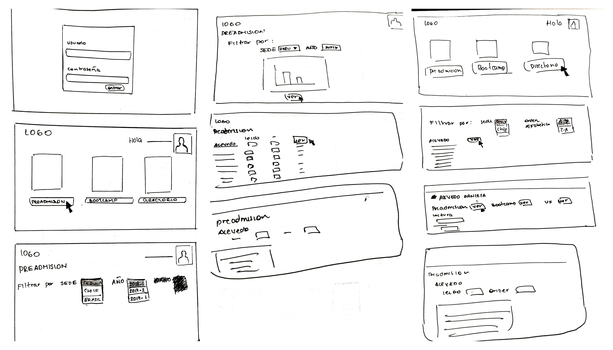
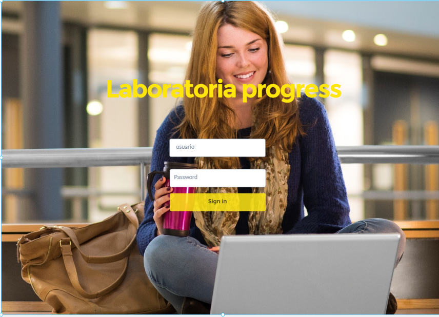

#  Laboratoria progress

  Laboratoria progress es una interfaz diseñada para las Training Managers. Esta aplicación permitirá visualizar el progreso de las alumnas de Laboratoria el cual sera de gran utilidad para que las TMs tengan una vista a detalle de cada alumna.

## Preámbulo

En Laboratoria, las Training Managers (TMs) hacen un gran trabajo al analizar la
mayor cantidad de datos posibles respecto al progreso de las estudiantes para
apoyarlas en su aprendizaje.

La principal medida de progreso de una estudiante en Laboratoria es su avance
completando los proyectos de la [Ruta de Aprendizaje](https://docs.google.com/spreadsheets/d/1AoXQjZnZ5MTPwJPNEGDyvn5vksiOUoPr932TjAldTE4/edit#gid=536983970)
y su desempeño en función a la [Rúbrica de Niveles Esperados](https://docs.google.com/spreadsheets/d/e/2PACX-1vSkQy1waRpQ-16sn7VogiDTy-Fz5e7OSZSYUCiHC_bkLAKYewr4L8pWJ_BG210PeULe-TjLScNQQT_x/pubhtml).
Sin embargo, para completar estos proyectos las estudiantes acceden a contenidos
de aprendizaje (lecturas, videos, ejercicios y quizzes) en un sistema que
llamamos LMS (Learning Management System). El LMS acumula data sobre quién
leyó qué, qué ejercicios se han completado, los resultados de los quizzes, etc.

A pesar de que la data de progreso del LMS (ej. lecturas leídas, ejercicios
completados, nota en quizzes, etc.) no impacta directamente en la evaluación
de una estudiante, sí es una pieza de información relevante que las TMs
quisieran visualizar para tener un mejor entendimiento de cómo va cada
estudiante en su proceso de aprendizaje.

##  Proceso de creacion de Laboratoria progress.

## Encuesta

Decidimos comenzar realizando una encuesta a las Training Managers, para obtener la información necesaria sobre sus necesidades a la hora de ver el historial de una alumna.
 [Encuesta](https://goo.gl/forms/bQ4w2lrQ72nYa6FQ2)

Usuario 1

Usuario 2

## Sketch
Luego de una encuesta previa procedimos a realizar un sketch a mano alzada de lo que sería el producto.

Teniendo los sketchs ya mencionados, creimos conveniente realizar una segunda entrevista para mejorar el prototipo y estar mas cerca a lo que las TMs requerían de una interfaz, y esto fue lo que nos dijo:

De acuerdo a esta última entrevista, procedimos a realizar un segundo sketch.

## Conclusiones

Concluimos que las usuarias (TMs), necesitaban una interfaz que les permita ver a detalle el historial de progreso de las alumnas de manera puntual y visualmente claro. Por ello se decidió hacer un menú con tres botones:

* Directorio, donde iría la información de todas las alumnas en general.
* Pre-admisión, como el nombre lo dice aqui iría solo información de alumnas de pre-admision.
* Bootcamp, al igual que en el de pre-admnisión aqui iría información de alumnas de bootcamp.

Cada una de estas opciones a su vez tendrían filtros como: sede, generación y orden alfabetico, que permitirían una busqueda más eficaz con respecto al progreso de una alumna.

## Diagrama de flujo 

## Prototipo

Una vez obtenido los sketchs finales, elaboramos muestro prototipo usando la plataforma de diseño 
 [Marvel app](https://marvelapp.com/)

 [Prototipo](https://marvelapp.com/dd994i9)

## Elaborado por:

Sandra Ortiz y Evelyn Meniz

